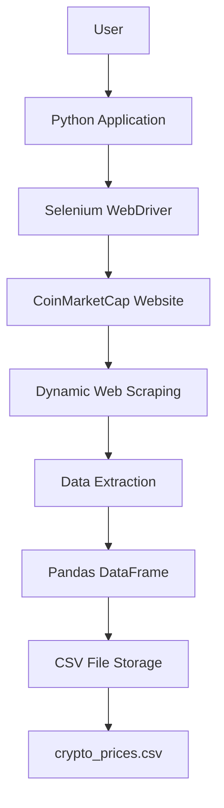

# 🚀 Cryptocurrency Price Tracker

## ⚡ Technologies Used

| Category | Technologies |
|----------|--------------|
| Programming Language | Python |
| Web Scraping | Selenium WebDriver |
| Data Handling | Pandas |
| Browser Automation | ChromeDriver |
| Data Source | CoinMarketCap |
| File Storage | CSV |

---
## 🏗️ System Architecture


## 📂 Project Structure

```txt
crypto-price-tracker/
│
├── main.py
├── crypto_prices.csv
├── requirements.txt
├── screenshots/
├── README.md
└── LICENSE
```

---

## 🚀 Installation & Setup

### 🔹 Clone Repository

```bash
git clone https://github.com/yourusername/crypto-price-tracker.git

cd crypto-price-tracker
```

---

## 🔹 Install Required Libraries

```bash
pip install selenium pandas webdriver-manager
```

---

## 🔹 Installation of Selenium

```bash
pip install selenium
```

---

## 🔹 Verify Selenium Installation

```bash
python -m selenium --version
```

---

## ▶️ Run the Application

```bash
python main.py
```

---

## 🌐 Target Website

```txt
https://coinmarketcap.com
```

---

## ⚡ Python Libraries Used

- Selenium
- Pandas
- webdriver-manager
- time
